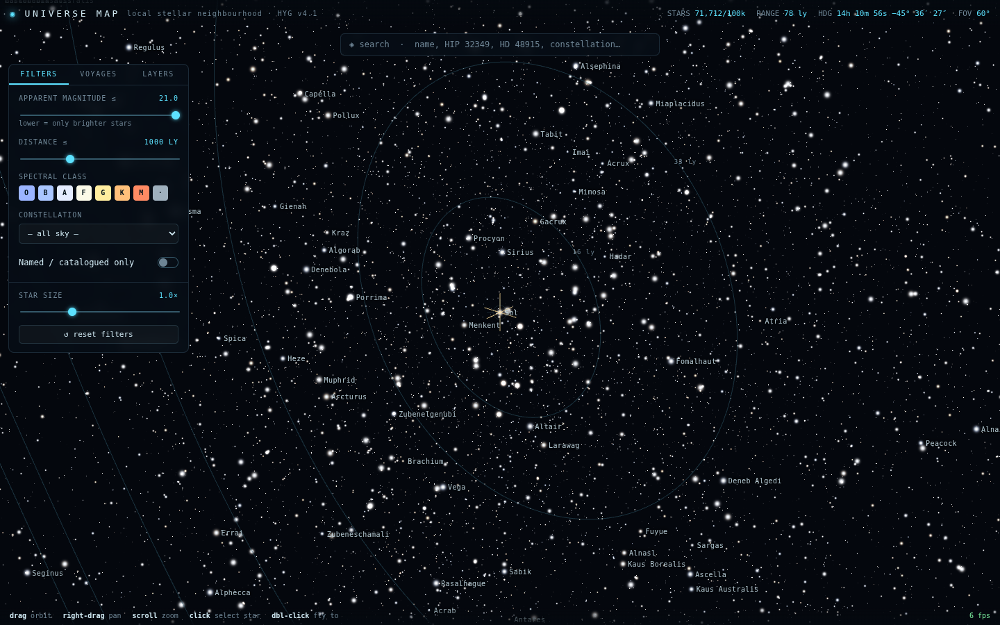
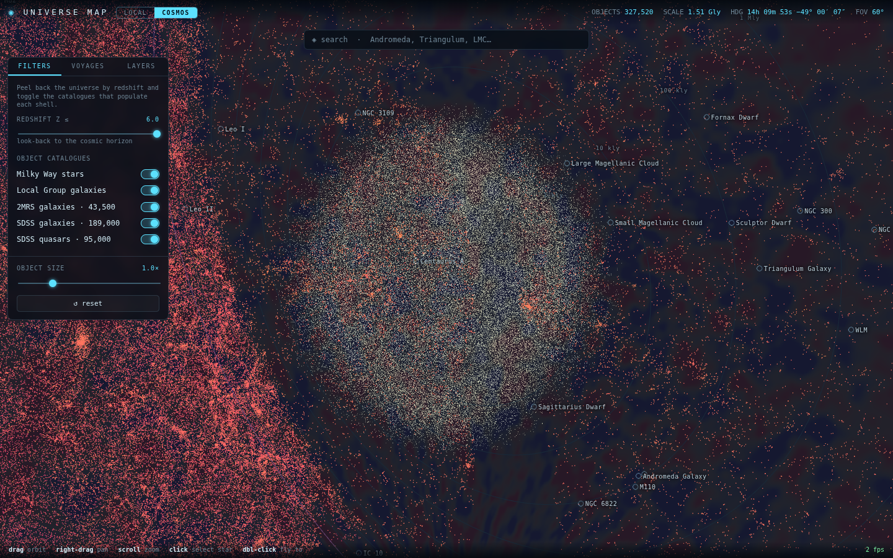

# UNIVERSE MAP

An interactive **3D navigable HUD map of the universe** — from the stars in our
own neighbourhood out to the cosmic microwave background at the edge of the
observable universe. It has two modes:

- **LOCAL** — a true-scale map of ~100,000 real stars (HYG catalogue), in
  parsecs, Sol at the origin.
- **COSMOS** — the whole **observable universe (~93 Gly across)** on a single
  logarithmic scale: ~327,000 real galaxies & quasars (2MRS + SDSS) placed by
  redshift, the Local Group, our galaxy's stars, and the CMB boundary shell.

Everything is **orbit / pan / zoom**, HUD/infographic in style, with almost no
decorative graphics — the objects *are* the data, and every number comes from a
real catalogue.




---

## Two ways to read the sky

### LOCAL — the stellar neighbourhood
100,000 stars from **HYG v4.1** with true 3D positions, coloured by their B–V
index via a blackbody model, sized by apparent magnitude. Filter by magnitude,
distance, spectral class, constellation; search by name / HIP / HD; click any
star for full data (distance, magnitude, luminosity, spectral type, RA/Dec,
constellation, catalogue IDs); optionally query the **live NASA Exoplanet
Archive** for its planets.

### COSMOS — the observable universe
The great challenge of a "whole universe" map is dynamic range: ~1 parsec to
~14,000 megaparsecs is **10+ orders of magnitude**, impossible in one linear
space. The solution here is a **logarithmic radial scale** — every object keeps
its true sky direction, but its radius is `3 · log₁₀(distance)`, so the entire
cosmos becomes a navigable onion centred on the Sun:

| Shell | Source | Objects |
| --- | --- | --- |
| Our galaxy's stars | HYG (log-radialised) | 100,000 |
| Galactic bridge | modelled Milky Way + inner Local Group (cyan) | ~314,000 |
| Local Group galaxies | curated, direct distances | 20 (named, searchable) |
| Nearby galaxies | **2MRS** (all-sky) | 43,500 |
| Cosmic web | **SDSS** galaxies | 189,000 |
| The quasar era | **SDSS** quasars (to z≈3.9) | 95,000 |
| The horizon | **real WMAP 9-yr CMB** shell at z≈1100 | boundary at 45.4 Gly |

Objects are coloured by distance (cyan near → crimson far, mirroring redshift).
A **redshift slider peels back the universe** by look-back distance; toggle each
catalogue; click any galaxy/quasar for its redshift, comoving distance (Gly & Mpc),
look-back time, RA/Dec, survey and a derived **IAU-style designation** (e.g.
`SDSS J120702.4−024415`). The **CMB radiation image is off by default** (the boundary
shell is a texture-heavy backdrop); enable **CMB radiation image** in Layers to show
it, and a manual **CMB opacity** control overrides the auto-fade.

### On object counts, "galaxies made of stars", and LOD

The map plots ~430,000 real objects. That is *not* an arbitrary cap you can lift
to "hundreds of billions": the observable universe holds ~10²² stars, and a
browser GPU renders a few million points at most (tens of millions with heavy
LOD). Just as importantly, **per-star data simply does not exist** for other
galaxies — only for our own Milky Way (via Gaia). So selecting a galaxy blooms it
into a **procedural, illustrative star cloud** — a deterministic spiral,
elliptical or irregular morphology grown from the object's own coordinates,
clearly labelled as a representation, not a catalogue — to convey that galaxies
are made of stars while staying honest that no catalogue resolves them.

### Reading the chart — icons, sizes, resolved structures & procedural fill

The map is drawn like an annotated chart, not a uniform dot-field:

- **Class icons.** Every named object carries a **distinct glyph** drawn from an
  icon atlas — a black-hole accretion ring, a pulsar's twin beams, a supernova
  burst, a nebula cloud, a ringed exoplanet, a galaxy spiral, a quasar with jets,
  a transient flash, a star, an open-cluster scatter, a globular ball, a
  supercluster web-node, a wall, a dashed void, an attractor target, and the ✦
  sparkle for your own imagined objects.
- **Sizes by class.** Icons scale by class (a galaxy or supercluster reads bigger
  than a pulsar or exoplanet); local stars scale by apparent magnitude; and the
  327k-point cosmic cloud sizes each point by proximity so the nearer cosmic web
  reads with depth.
- **Glow shards by magnitude.** The brightest objects grow subtle four-point
  diffraction shards (with fainter diagonals), their intensity scaled by apparent
  magnitude — so Sol, Sirius and the other luminaries sparkle while faint stars stay
  clean points. Drawn procedurally in the point shader, so it costs nothing extra.
- **Resolve galaxies & clusters (LOD).** Two independent Layers toggles. **Resolve
  galaxies** blooms notable galaxies into a spiral/elliptical/irregular disc from
  their Hubble type as you approach; **Star cluster shapes** blooms globulars into a
  dense sphere and open clusters into a loose scatter. Both fade back to a single
  icon as you pull away. GPU-driven, so each is one draw call.
- **Supervoid zones.** Toggle **Supervoid zones** to mark the great cosmic voids
  (Boötes, the Local Void, the Eridanus Supervoid behind the CMB Cold Spot, the
  Giant Void…) as translucent wireframe bubbles — flattened along the line of sight
  to match the log-radial depth compression. The imagined fill also stays empty
  inside them, so the voids read as voids at every layer.
- **⟿ The Ledger of Ways — trade & war routes.** Toggle **Trade & war routes** for a
  charted network of **~2,950 imagined crossings** — **2,679 commercial** (amber:
  courier trunks, ore-hauls, pilgrim ways, salvage loops, spice roads…) and **268
  military** (crimson: war-roads, blockades, deep-strike corridors, funeral patrols…),
  a deliberate ~**10:1** split — a peacetime galaxy runs on trade, not war. Each has a
  *unique poetic name* and a QTR-canon operator ("The Silk Road of Suns" · Pelagian
  Assembly; "The Nūbi Deep-Strike"; "The Widowmaker Picket"; "The Weeping Gauntlet";
  "The Watch of Pilgrims"…). About **150 (~5%) are hand-authored flagships**; the rest
  fill out procedurally to a full spread across the whole object pool — but **every
  waypoint is a real catalogued object** (stars, clusters, galaxies, structures and
  supervoids), so the whole ledger is flyable. Because the network is large, the Layers
  panel lists it through a **search box and category filters** (showing the flagships
  first, then a capped page): **click to trace** a route (it highlights, labels and
  frames itself) or hit **▶** to **load it into the NAV COMPUTER** (drive and all) and
  engage. Solaris.Ai knows the ledger too: *"show me the military routes near Virgo"*,
  *"fly the Amber Ladder"*.
- **Procedural fill — a "known universe" (imagined).** Toggle **Procedural fill**
  to complete the map into a fully-charted universe for storytelling. Every
  direction is brought **up to the peak surface density of the best-surveyed real
  regions** (≈650k synthetic objects), so the sky reads as completely mapped —
  filling the Zone of Avoidance behind the Milky Way and the unsurveyed hemisphere
  — while **catalogued voids stay empty** (Boötes, the Local Void…). The fill is
  **gravity-shaped**, not a smooth haze: points are draped onto a **cosmic web**
  that reflects the real data. Two fields drive placement — a box-blurred 3-D map
  of the **real galaxy density** (so procedural structure continues and thickens
  the observed filaments and clusters), and a **Worley/Voronoi void field** whose
  seed points are dropped into the real voids, so even blank regions grow **walls,
  filaments and cluster-nodes around empty voids** (void diameters ~40 Mpc, the
  observed scale). Crucially, these objects are **usable exactly like real data**:
  each is placed at a true distance (from a sampled redshift), is **selectable**,
  carries a generated **imagined identity** (a name + `KUC J…` designation, a
  morphology, distance and a lore line), and can be **added to a route** with
  correct relativistic travel times. It's clearly imagined — tinted **green** by
  default with a **green ↔ match-data** switch (match makes it read as a real,
  complete survey). Selectable on click (kept out of the hover scan for smoothness
  at ~650k points).

- **Galactic bridge — the missing middle scale (cyan, modelled).** Between the
  ~1 kpc local star bubble (all the HYG catalogue reaches) and the Local Group /
  extragalactic data (which begins at Mpc scales) sits an **empty shell** — the
  body of our own Galaxy and the inner Local Group, which no per-object catalogue
  maps at this fidelity. The **Galactic bridge** layer fills it with a *modelled*
  Milky Way: an exponential **disk with four logarithmic spiral arms** (pitch 12.8°)
  and a **boxy bar/bulge**, a **globular-cluster + stellar halo** (157 clusters,
  most within 40 kpc, rare outliers to ~150 kpc), the **Magellanic Clouds** and the
  Magellanic Bridge between them, and a scatter reaching out to **Andromeda (M31)**
  and **Triangulum (M33)**. It is built in galactic coordinates — Sun at the origin,
  the Galactic Centre 8.2 kpc toward Sagittarius — then rotated into the scene's
  equatorial frame (standard IAU J2000 matrix), so the band of the Milky Way crosses
  the sky at the correct tilt and the Clouds sit at their true positions. Tinted
  **cyan** to set it apart from the real (pink/orange) and imagined (green) data, and
  it's **selectable & route-able** like any other object.

### Enter a galaxy — real imagery & interior exploration

Any galaxy's info panel has an **⛶ enter galaxy** button. It pulls a real sky
cutout for that position from **CDS hips2fits** (HiPS surveys — DSS2 all-sky,
SDSS where available; the service is CORS-enabled, so the browser fetches it
directly, no proxy), then samples a **3-D star field whose density and colour
follow the actual image** — the arms, bar and bulge of the real galaxy — and
drops you *inside* it. There you can orbit and fly through the stars, **click any
star to select it**, and **trace routes between stars** with true intra-galaxy
distances and relativistic travel times (a crossing of tens of thousands of
light-years, kyr of ship time). A banner shows the galaxy, whether the field is
image-derived or a procedural fallback (used when offline), its diameter, and a
**star-count selector** (60k → 450k · ultra → **1M · extreme**) so you can crank
the density for a strong GPU.

- **Real per-galaxy size.** The interior is scaled to the galaxy's actual
  diameter: a curated table for the well-known ones, refined live from **SIMBAD's
  angular size** (`galdim_majaxis` → physical kpc via the distance). So Andromeda
  is larger than a dwarf, and intra-galaxy route distances are physically honest.
- **Million-star picking.** Interiors up to ~1M stars stay instantly clickable via
  a **uniform-grid spatial index** — a pick marches the ray through grid cells and
  tests only the tube around it (~1 ms at 1M vs ~25 ms brute-force).
- **Sharpest survey, automatically.** The cutout tries **SDSS colour** first and
  falls back to **DSS2 all-sky** when the galaxy is outside the SDSS footprint —
  detected from the image itself (out-of-footprint HiPS tiles come back
  transparent), so no footprint polygon is hardcoded. The banner shows which
  survey supplied the field.
- **Custom image / survey.** Set `app._gxImageOverride = '<url>'`,
  `app._gxSurvey = 'CDS/P/PanSTARRS/DR1/color-z-zg-g'` (still falls back to DSS2),
  or `app._gxSizeLookup = false` to skip the live size query.

**⤴ exit galaxy** returns you to the cosmos where you left off.

### Galaxy imagery overlay (flat billboards)

The Layers panel has a **Galaxy imagery · HiPS** toggle. When on, notable galaxies
(the atlas + Local Group) get a **flat, camera-facing billboard of their real sky
cutout** floating at their position in the cosmos view, alongside the point-cloud
data — additively blended so the image's black sky drops out and each galaxy reads
as light. Each billboard uses the same **SDSS-where-covered, DSS2-elsewhere** auto
selection as the interior. Textures are fetched lazily on first enable.

## The Cosmic Atlas (knowledge base)

A dedicated **ATLAS** tab and a set of typed markers overlay a curated knowledge
base of the most significant real objects and events across **every major class**:

> supermassive & stellar **black holes** · **neutron stars / pulsars / magnetars**
> · **supernovae & remnants** · **nebulae** · **exoplanet systems** · notable
> **galaxies** · **quasars & blazars** · **transient events** (gravitational-wave,
> gamma-ray & fast-radio bursts) · **extreme stars**

Each entry carries a real sky position, distance and a headline-astrophysics note
(e.g. Sgr A*, M87*, TON 618, the Crab & Vela pulsars, SGR 1806-20, Cassiopeia A,
the Pillars of Creation, TRAPPIST-1, GW170817, GRB 221009A, UY Scuti…). Browse by
category, filter by text, and click to fly to it (hopping to COSMOS when the
object is beyond the true-scale LOCAL view). It is deliberately **curated, not
exhaustive** — the universe holds billions of catalogued objects — but it's a real,
extensible foundation, and it grows two ways:

### Live data retrieval (SIMBAD) — and it persists

The ATLAS tab has a **resolve-live** box: type any real object's name and it is
resolved on the fly against **SIMBAD (CDS)** — coordinates, object type, spectral
type and a distance derived from parallax or redshift — then placed on the map and
**saved to your library**. Any real object's info panel also has a **⟲ SIMBAD**
button to enrich it with live data. SIMBAD's service is CORS-enabled, so this runs
straight from the browser (no proxy needed).

Alongside it, a **◈ grow** control pulls whole batches from a live catalogue and
folds real objects into your library in one shot — pick a preset and a count:

- **pulsars** — the **ATNF Pulsar Catalogue** via VizieR (`B/psr/psr`), placed by
  their catalogued distances (kpc → ly).
- **galaxies** / **quasars** — **SIMBAD** by object type + redshift, with distances
  from the ΛCDM comoving integral.
- **near view** — a **SIMBAD cone search** around wherever the camera is pointing,
  so you can densify the patch of sky you're actually looking at.

Everything you add — resolved names, grown batches, imagined objects — is written to
**localStorage**, so it **persists across reloads** (it does *not* reset on restart).
**Export / Import** round-trips your whole library as JSON, and **Clear** wipes it.
(Live services need outbound network; if a query is blocked or times out the control
says so and the existing map is untouched.)

### The Codex — an imported fiction knowledge base

A **📖 CODEX** button (top bar) opens the *Immeasurable Spaces* universe database —
a bundled example of a large, richly-linked story knowledge base (406 records
across 16 types: objects, events, concepts, hazards, reconciliations, a two-fleet
lexicon, phrases, places, worlds, ships, factions, technologies, nav axes…). It's
a full browser: **search + type facets + a graph-linked detail view** (every record
shows its `related` / `same_as` / `denotes` / `in_language` / `located_on` links as
clickable chips that walk the graph), a **real ↔ fiction** anchor line, and a
**DIAGRAM** tab that renders the canon's 2D "tower" map (the depth / adjacency /
constitution axes, substrate floor → the limit Κ) with clickable nodes. Drop a
different `qtr-universe-db.json` in `public/data/` to swap in your own corpus; the
schema block in the file is self-describing.

**The real ↔ fiction bridge.** Where a fictional class names a real astrophysical
one — its `real_anchor` (e.g. *Natural seam-wells* → "Black holes"), or a matching
name/category — the detail view grows a **◎ show the real … on the map** button.
Click it and the app leaves the story frame: it switches to **COSMOS**, filters the
Cosmic Atlas to that real category, and flies you to the first real object of the
class. So from the seam-wells entry you land on **Sagittarius A***, with M87\*, TON
618 and the rest of the real black holes listed beside it — the imagined and the
observed pinned to the same sky.

### Story Studio — imagined objects & events

The **✦ Imagine** button opens an authoring modal to add **hypothetical objects
and events** for story-crafting: name, category, type, position (RA/Dec, or *use
view* to drop it where you're looking), distance, and lore/notes. Imagined objects
render as distinct magenta ✦ markers in both modes, are searchable, route-able and
focus-able like anything else, and persist in your library. Provide a batch as a
JSON file via **Import** — the format is `{ "objects": [ { "name", "kind":
"imagined", "category", "type", "ra"(h), "dec"(°), "distLy", "facts" }, … ] }`.

## Story voyages

A voyage is a route of stops with a narrative at each — a documented journey
traced across the map, the way Ulysses' or Darwin's voyages are charted.

**Local mode**
- **The Sun's Nearest Neighbours** — every star within ~12 ly, in distance order.
- **Voyager — the Interstellar Errand** — where the real probes are actually heading.
- **An Interstellar Odyssey** — a mythic grand tour shaped like Homer's Odyssey.

**Cosmos mode**
- **To the Edge of the Universe** — a scale-ladder zoom out from the Sun through
  the Milky Way, Local Group, supercluster, cosmic web and quasar era to the CMB,
  progressively revealing more distant objects at each stop.

### The Expedition Log — 20 preset routes

The VOYAGES tab also carries an **Expedition Log**: two dozen charted, Odyssey-style
routes of varying length, from a four-light-year hop to a 47-Gly haul to the edge
of the observable universe. Each stop is a real object resolved from the
catalogues, and every card offers two ways to travel:

- **◈ trace** loads it straight into the NAV COMPUTER (below) with true leg
  distances, headings and relativistic travel times — then **⏵ ENGAGE** flies it.
  On a **mixed-scale** route the continuous autopilot itself **pauses at each galaxy
  waypoint and descends inside it** — the star field fills the view (the route is
  kept), you free-look, and **▶ continue course** rises back out and flies on to the
  next stop.
- **▶ cruise** runs a stepped, cinematic tour (prev / next / auto) with the
  narrative at each stop — and **mixed-scale** expeditions (marked ⛶ *descends*)
  also drop you inside a galaxy mid-voyage.

*The Deep Descent* and *The Island Landings* land you inside Andromeda, Triangulum
and the Whirlpool (or the Magellanic Clouds) in turn — by cruise, or now by ENGAGE.

Either way the app switches to the right scale automatically. New in this set:
*The Titans' Road* and *Walking Orion* (the great supergiants, hundreds of ly out),
*The Open-Cluster Run*, and the descent tours *The Deep Descent* and *The Island
Landings*.

> *The First Crossing* · *The Sirian Run* · *Errand of the Red Giants* · *Voyage to
> the Galactic Heart* · *The Nebula Pilgrimage* · *Graveyard of Giants* · *The
> Lighthouse Keepers* · *Sirens of the Deep* · *The Andromeda Passage* · *Grand Tour
> of the Island Universes* · *The Local Group Odyssey* · *Climb to the Great
> Attractor* · *The Shapley Expedition* · *Along the Sloan Great Wall* · *Into the
> Quasar Age* · *To the Edge of the Observable* · *The Ulysses Circuit* · …

Edit `public/data/expeditions.json` to add your own — each stop is `{ "star": name }`,
`{ "obj": name }` (atlas / Local Group / cluster / structure), or an explicit
`{ "ra", "dec", "distLy", "label" }`.

### Sector grid (map HUD)

The Layers panel has a **Sector grid · map** toggle that overlays a 3-D block
cage, turning the view into a spaceship-style navigation chart:

- the **main cosmic plane** (the celestial equator) rendered bright — three
  concentric range rings crossed by radial spokes at each 2ʰ of right ascension;
- **nine ring-planes above and nine below** the cosmic plane, stacking the volume
  into height bands (the celestial-declination decks);
- **vertical pillars** rising through every spoke × ring node, and the celestial
  **polar axis** — together dividing the universe into addressable sector blocks.

The telemetry bar always shows the current **SECTOR** code (an RA-column /
Dec-row / distance-tier cell, e.g. `N04·10`) alongside heading and scale. The
cage scales with the mode — out to the CMB in COSMOS, to the stellar
neighbourhood in LOCAL.

## Navigation — TEKNÉ · NAVCOM

The map doubles as a **spaceship navigation computer**, re-skinned as the NAVCOM of
the *Tekné* — the Idrenes Composite from the imported QTR **"Immeasurable Spaces"**
canon (see the Codex). You are not limited to the preset voyages — you can plot
arbitrary routes:

- **Plot a course**: toggle **◉ plot** and click the map to drop waypoints (they
  snap to an object under the cursor, or land in free space at the focal depth),
  or select any object and hit **＋ route**. **＋ pt** drops a free-space waypoint
  where you're looking, so you can route through empty space.
- **Curved legs**: each leg is drawn as a gentle arc (a Catmull-Rom spline through
  the waypoints, bowed outward from Sol) rather than a straight chord, so a route
  reads as a flight path instead of appearing to skewer every object that happens to
  line up between its two ends. The autopilot and the tracked reticle follow the same
  curve, so the flown path and the drawn line stay identical — and it's a one-off
  spline build, no per-frame cost.
- **Edit the course**: reorder (▲▼), remove (✕) or reverse (⇄) any waypoint.
- **Pick a DRIVE → travel time**: instead of a raw cruise speed, choose a QTR
  **drive** — a depth rung on the *Ship-Relative Speed Law*, where velocity is a
  function of vacuum **depth**, not thrust, and a ship's *class* is the maximum depth
  it can reach:

  | Class | Drive | Crossing speed | Regime |
  | --- | --- | --- | --- |
  | 0 | Casimir Sailer | 0.1 c | sub-light (real dilation) |
  | 0 | Relativistic run | 0.994 c | sub-light (real dilation) |
  | I | Idrenes–Sōrn · OCT-0 | ~10¹⁰ c | determinate |
  | II | Unruh Catamaran | ~10¹³ c | determinate |
  | III | Squeezing Bathyscaphe | ~10¹⁶ c | indeterminate |
  | ω | **Idrenes Composite · Tekné** | ~10²⁰ c | seam-locked |

  Each leg is an **Idrenes-bridge crossing**; the console shows its distance, heading
  and time, and the totals give the **coordinate (home-frame) time**, the **crew
  (proper) time**, and the number of bridges. Sub-light classes use real Lorentz
  dilation; the faster-than-light classes discount crew time by the drive's
  determinate-regime offset. At Class I a 12 Gly crossing is ~1 coordinate year / ~5
  crew-months — the *Tekné* is the only NAVCOM that runs this fast.
- **⏵ ENGAGE · thread 𝔍**: flies the plotted course with a live nav HUD (current
  crossing, heading, range to next, coordinate & crew time); hold / step / disengage.
  You can **orbit and zoom freely** while it flies, and a **blinking reticle** marks
  the tracked point on the route.
- **▤ track panel** (or `T`): a linked, transparent panel with live telemetry of
  the tracked point — its **position** (RA/Dec + distance from Sol), **heading**,
  **drive** (class & crossing speed), current **crossing & progress**, and route
  **travelled / remaining** with coordinate and crew time.
- **Save / load**: name and save routes (persisted in localStorage), reload them,
  and import/export the whole set as JSON.

Distances are always *physically correct* even in COSMOS mode: the display radius
there is logarithmic, but every object carries its real direction and distance, so
leg lengths and times come from true 3-D positions (parsecs → ly / Mly / Gly).
LOCAL mode is metrically exact throughout.

You can also **◎ focus** any object to re-centre the orbit pivot on it (navigate
around *it* instead of the Sun).

### ✦ Solaris.Ai — the NAVCOM agent

The **✦ NAVCOM AI** button opens a chat with **Solaris.Ai**, the NAVCOM core of the
*Tekné* — a colloquial navigator that both **answers questions** (real astronomy
*and* the QTR canon) and **actually flies the ship**. Ask it things like:

- *"plot Sol → Andromeda Galaxy → Virgo Cluster"* — it resolves the names, builds the
  course, and reports the path, coordinate & crew time and bridge count.
- *"take me to the Great Attractor at Class II"* — it sets the drive and lays in a
  course; add *"and engage"* and it threads the seam.
- *"what is the Sōrn drive?"* / *"where is the Boötes Void?"* — it consults the Codex
  and the sky index and answers in the ship's voice.

Under the hood it's an **agent with tools**: `search_sky`, `lookup_qtr`, `plot_route`,
`add_stop`, `set_drive`, `engage`, `set_mode`, `focus`, `set_layer`, `get_state`,
`clear_route` — so anything it says it will do, it does, live on the map.

**Bring your own model.** The agent speaks the **OpenAI-compatible** chat API, so it
works with a local model on your own GPU or a hosted API — click **⚙** to set the
endpoint:

| Provider | Base URL | Key |
| --- | --- | --- |
| **LM Studio** (local) | `http://localhost:1234/v1` | none |
| **vLLM** (local) | `http://localhost:8000/v1` | none |
| **Ollama** (local) | `http://localhost:11434/v1` | none |
| **OpenAI** | `https://api.openai.com/v1` | `sk-…` |
| **Anthropic** (OpenAI-compat) | `https://api.anthropic.com/v1` | `sk-ant-…` |

Everything stays in your browser (the endpoint, model and any key live only in
`localStorage`); pick a **tool-calling capable** model. For local servers, enable CORS
(LM Studio and vLLM do by default). The **list** button pulls the served model ids and
**test connection** checks it's reachable.

Also plotted: **star clusters** (open + globular) in both modes, and named
**large-scale structures** in COSMOS — the Virgo & Coma clusters, the Great
Attractor, the Shapley & Laniakea superclusters, the Sloan Great Wall, the Boötes
Void and more.

## Controls

| Action | Input |
| --- | --- |
| Orbit / pan / zoom | drag · right-drag · scroll |
| Select object | click · **fly to**: double-click |
| Re-centre pivot on object | object panel ▸ ◎ focus |
| Add waypoint / trace a route | object panel ▸ ＋ route |
| Switch scale | LOCAL / COSMOS toggle (top bar) |
| Search / jump | top search box |
| Recenter on Sol | Layers ▸ recenter · focus chip ✕ |

### Manual & hotkeys

The **❔ MANUAL** button (top bar, or press `?` / `F1`) opens an in-app guide with a
full hotkey reference. The shortcuts:

| Key | Action | | Key | Action |
| --- | --- | --- | --- | --- |
| `1` `2` | LOCAL / COSMOS | | `Space` | engage / pause autopilot |
| `H` | home (recenter on Sol) | | `[` `]` | prev / next stop (cruise·voyage·autopilot) |
| `/` | focus search | | `S` | sector grid |
| `C` | open CODEX | | `B` | galaxy imagery |
| `?` `F1` | open manual | | `V` | resolve structures |
| `F` | focus on selection | | `G` | enter / exit galaxy |
| `R` | add selection to route | | `P` | plot course |
| `T` | tracking panel | | `Esc` | close · exit · disengage · clear |

Hotkeys are inert while a text field is focused or an overlay is open.

Dev/preview server runs on **port 5333** (`npm run dev`).

### Deferred (by request)

"Focus" re-centres the camera *pivot* on an object, but the coordinate origin
stays at the Sun. A stronger **"re-origin on object X"** — translating the whole
LOCAL frame so X is at (0,0,0) and every ring / distance / telemetry reads *from
X* — is intentionally **not** built yet (noted here for later). It is clean and
exact in LOCAL (a rigid translation preserves all distances); it is deliberately
avoided in COSMOS, where the logarithmic radius is inherently Sun-centred and
re-origining would misrepresent the cosmology.

---

## Running it

```bash
npm install
npm run dev        # http://localhost:5333
npm run build      # -> dist/ (fully static)
```

All catalogues are preprocessed and committed under `public/data/`, so the app
runs offline with no build-time network.

## Regenerating the data

```bash
npm run build:data     # stars: HYG v4.1 -> 100k working set + voyages
npm run build:cosmos   # galaxies/quasars: 2MRS + SDSS -> layers + scale voyage
npm run build:cmb      # real WMAP 9-yr CMB map -> equirectangular shell texture
npm run build:extras   # curated star clusters + large-scale structures
npm run build:atlas    # curated cosmic-atlas knowledge base
```

`build-cosmos.mjs` fetches the 2MASS Redshift Survey (VizieR) and SDSS
spectroscopic samples (SkyServer SQL) in redshift slices, converts each object's
redshift to a comoving distance, and writes the compact binary layers. Raw
responses are cached under `scripts/.cache/`.

### Cosmology — no Astropy required

Redshift → comoving distance uses a flat **ΛCDM (Planck 2018)** model integrated
numerically in `scripts/cosmology.mjs` (and mirrored in `src/util/cosmology.js`
with a lookup table for the frontend). It is dependency-free and validated
against published distances (z=1 → 3400 Mpc, horizon at z=1100 → 45.4 Gly radius
≈ 91–93 Gly diameter). Run `node scripts/cosmology.mjs` to see the self-test.

## Architecture

```
scripts/
  build-data.mjs      HYG catalogue -> star binary + local voyages
  build-cosmos.mjs    2MRS + SDSS -> galaxy/quasar layers + CMB + scale voyage
  cosmology.mjs       ΛCDM comoving-distance integral (+ self-test)
  voyages.source.mjs  authored local voyages
  localgroup.mjs      curated Local Group galaxies
public/data/          generated, committed assets (stars + cosmos, ~10 MB)
src/
  main.js             boot: load both datasets, wire HUD, start loop
  app.js              mode-aware state, selection, voyages, render loop
  data/               catalog.js (stars) · cosmosData.js · remote.js (live)
  render/
    scene.js          renderer, camera, OrbitControls, fly-to
    starfield.js      100k star points (blackbody colour, GPU filtering)
    cosmos.js         log-radial galaxy/quasar layers, Local Group, CMB shell
    picking.js        CPU nearest-ray selection
    labels.js         projected DOM labels
    voyagePath.js     local voyage route + markers
  hud/                hud.js · filters.js · cosmosHud.js · search.js
                      infoPanel.js · voyages.js
  util/               color.js · astro.js · cosmology.js
```

### Rendering notes
- Each mode is a set of `THREE.Points` clouds sharing one renderer/camera/HUD.
  Stars use a blackbody-colour shader sized by magnitude; cosmos layers use a
  constant-screen-size shader coloured by distance, with a redshift cut-off
  uniform.
- Picking is a CPU nearest-ray angular scan — exact and ~1–3 ms even across
  100k–330k points, so no GPU id-buffer is needed.
- The CMB shell carries the **real WMAP 9-year ILC map**: `scripts/build-cmb.mjs`
  reprojects the HEALPix FITS (Nside 512, NESTED, galactic) to an equatorial
  equirectangular PNG — implementing `ang2pix_nest` and the equatorial↔galactic
  rotation by hand, dependency-free. It fades in as the camera nears the horizon,
  and falls back to a procedural texture if the PNG is absent.

## Dynamic data retrieval

The base map is static so it always works. On top of that, several live TAP paths
run straight from the browser (all best-effort, with an honest CORS/timeout
fallback; `remote.setProxy(url)` routes through a pass-through if a service lacks
CORS): a selected star exposes **◇ query exoplanets** (NASA Exoplanet Archive);
the ATLAS tab resolves single names against **SIMBAD** and **◈ grows** whole
batches from **SIMBAD** and the **ATNF Pulsar Catalogue (VizieR)** into your
persistent library.

## Data & credits
- Stars: **HYG database v4.1** (astronexus) — Hipparcos / Yale / Gliese.
- Galaxies (nearby): **2MASS Redshift Survey** (Huchra et al.), via VizieR/CDS.
- Galaxies & quasars (deep): **Sloan Digital Sky Survey** DR17, via SkyServer.
- CMB map: **WMAP 9-year ILC** (NASA / LAMBDA), reprojected from HEALPix.
- Exoplanets (live): **NASA Exoplanet Archive**.
- Live growth: **SIMBAD (CDS)** and the **ATNF Pulsar Catalogue** (via VizieR/CDS).
- Galaxy imagery (live): **CDS hips2fits** over HiPS surveys (**DSS2**, **SDSS**, …).
- Cosmology: flat ΛCDM, **Planck 2018** parameters.
- Rendering [three.js](https://threejs.org) · build [Vite](https://vitejs.dev).
